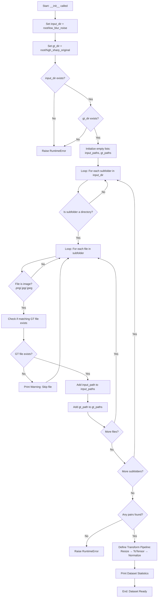
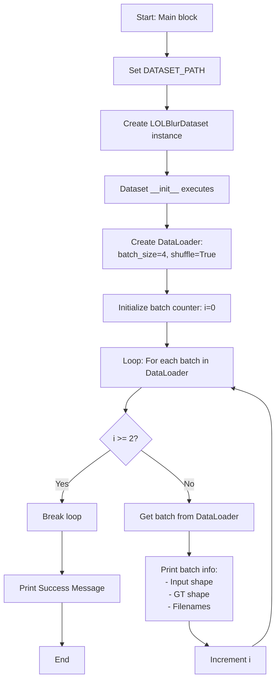
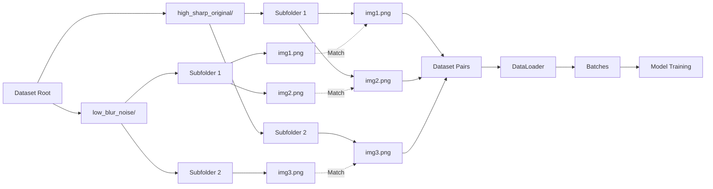

# LOL-Blur Dataloader Flowchart

## Initialization Flow



## Data Retrieval Flow (__getitem__)

```mermaid
flowchart TD
    A[Start: __getitem__ called with idx] --> B[Get input_path from input_paths[idx]]
    B --> C[Get gt_path from gt_paths[idx]]
    C --> D[Open input image: PIL Image.open]
    D --> E[Convert input to RGB]
    E --> F[Open GT image: PIL Image.open]
    F --> G[Convert GT to RGB]
    G --> H[Apply transform to input:<br/>Resize → ToTensor → Normalize]
    H --> I[Apply transform to GT:<br/>Resize → ToTensor → Normalize]
    I --> J[Extract filename from input_path]
    J --> K[Return Dictionary:<br/>input, gt, filename]
    K --> L[End]
```

## Main Execution Flow



## Complete System Flow


